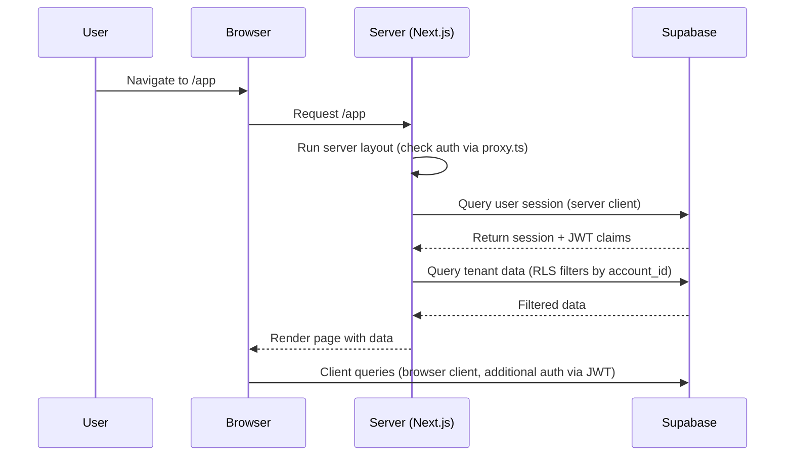
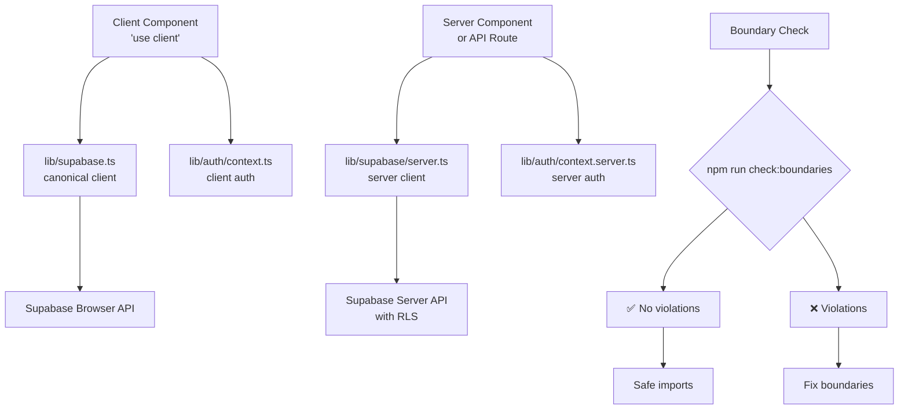

# DoveApp Architecture

## What This Repo Is

- **Field Service Management Platform**: Web app for contractors to manage clients, jobs, estimates, invoices, and technician scheduling.
- **Multi-Tenant SaaS**: Each account has isolated data via Row Level Security (RLS) on `account_id`.
- **Next.js 16 App Router**: Server and client components with Supabase for auth and data.
- **Option A Data Access**: API routes call Supabase directly; RLS enforces tenant isolation.

## Auth + Supabase Boundaries

### Client-Only Files

- `lib/supabase.ts`: Canonical client singleton (preferred for UI components)
- `lib/supabase/browser.ts`: Client factory (deprecated, advanced usage)
- `lib/supabase/client.ts`: Client factory (deprecated, compatibility)
- `lib/supabase/index.ts`: Client barrel exports (compatibility only)
- `lib/auth/context.ts`: Client auth context (decodes JWT for browser)

### Server-Only Files

- `lib/supabase/server.ts`: Server client factory (for API routes and server components)
- `lib/auth/context.server.ts`: Server auth context (uses server session)
- `lib/auth/requireRole.server.ts`: Server role guard (redirects on failure)

### Do / Don't

- ✅ Import client modules only in `"use client"` components
- ✅ Import server modules only in server components or API routes
- ✅ Use RLS for tenant isolation (account_id filtering)
- ❌ Never import client Supabase in server code (detected by npm run check:boundaries)
- ❌ Never import server-only modules in client code
- ❌ Bypass RLS except via service_role (restricted in migrations)

## Data Access Model (Option A)

Tenant isolation is primarily enforced by Supabase RLS policies using `account_id`. API routes call Supabase directly without application-level filtering. Authenticated users see only their account's data due to RLS.

- **RLS Enforcement**: Policies filter by `account_id = request.jwt.claim.account_id`
- **Service Role Bypass**: Restricted to service_role only via `supabase/migrations/20250116000000_fix_rls_bypass_policies.sql`
- **Verification**: `supabase/rls/verify_all_isolation.sql` automates cross-tenant isolation testing

## Diagrams

### Sequence: Page Load Flow

### Flowchart: Module Boundaries

## Guardrails

- **npm run check:boundaries**: Prevents server code from importing client Supabase modules. Scans `lib/` and `app/` for violations and fails CI if found.

## Where to Look

- `proxy.ts`: Request interception, auth checks, header injection
- `lib/auth/`: Auth helpers (client vs server split)
- `lib/supabase/`: Client/server Supabase factories
- `app/api/`: API routes (direct Supabase calls)
- `supabase/migrations/`: Schema and RLS policy changes
- `supabase/rls/verify_all_isolation.sql`: Automated isolation verification
- `docs/security/rls-audit.md`: RLS policy audit and bypass restrictions
